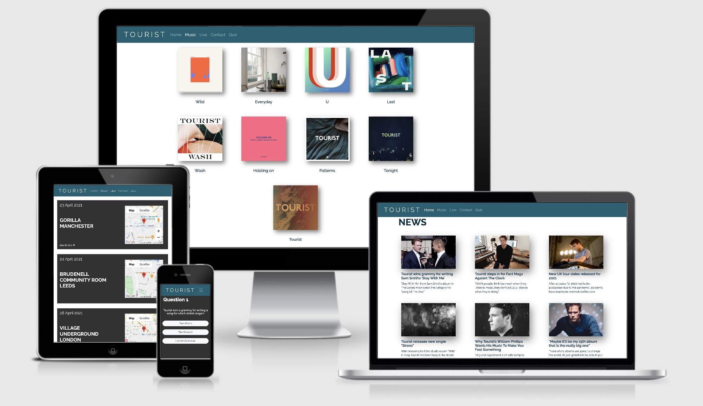

# Milestone project 2 - Tourist 
View the live project <a href=""> here

***
## Contents
* [What is the purpose of this project?](what-is-the-purpose-of-this-project?)
* [User experience](#user-experience)
    * [User stories](#user-stories)
    * [Design](#design)
        * [Font](#font)
        * [Colours](#colours)
        * [Wireframes](#wireframes)
* [Technologies used](#technologies-used)
* [Features](#features)
    * [Existing features](#existing-features)
    * [Future features](#future-features)
* [Testing](#testing)
* [Deployment](#deployment)
    * [Cloning](#cloning)
* [Credits](#credits)
* [Media](#media)
* [Acknowledgements](#acknowledgements)
* [Special thanks](#special-thanks)
***

***
## **What is the purpose of this project?**
This project is my second milestone project where I have developed an interactive front end website for an electronic musician called Tourist. 
The aim of this website was to create a platform where fans of Tourist can go to keep up to date with the latest news, buy music, view upcoming gigs, 
buy tickets, get in touch with the artist and even test their knowledge of the musician with a quiz. 
The main requirements for this project were to create an interactive front end website whilst implementing all of the technologies that I have learnt 
so far on the Full Stack Software Development course. The technologies used are HTML5, CSS3 and Javascript which work together to create an intuitive interactive website.
The Bootstrap CSS library was used to create the structure of my website using the grid system, which enabled me to make the website fully responsive across a range of different 
screen sizes including mobile, tablet and desktop. The JQuery framework was also implemented in certain parts of my Javascript code. 

## **User Experience**

### User stories: 

* User goals: 
    * As a user, I want to visit the website to keep up to date with the latest news about Tourist. 
    * As a user, I want to find out the dates and locations of Tourist’s upcoming gigs and buy tickets. 
    * As a user, I want to find out where I can find and follow Tourist on social media. 
    * As a user, I want to be able to easily navigate through the website and information to be provided in a clear and informative manner.
    * As a user, I want to get in touch with Tourist to enquire about booking him to play a show at my venue. 
    * As a user, I want to test my knowledge of my favourite musician. 
    * As a user, I want to browse through Tourist’s catalogue of music and buy some. 

* The website is designed to meet these user requirements by:
    * On the home page the website provides a news section which contains links to articles on the latest news about Tourist. When an article is clicked the link opens in a new tab enabling the user to easily get back to where they left off. 
    * By providing a live music section where the user is able to view the dates of upcoming gigs. The google maps API is utilised in this section to enable the user to see the exact location of each venue. 
    * The footer section of each page provides links to all of Tourist’s social media pages.
    * By providing a navigation bar which remains at the top of the page at all times so the user can easily navigate between pages. The footer section contains a button to bring the user back to the top of the page. The information is provided in a tidy manner and no areas are overcrowded.  
    * By giving the user the opportunity to contact the artist directly on the contact page. 
    * By providing an intuitive quiz where the user can have a go at answering some trivial questions about Tourist. 
    * By presenting all of Tourist’s music on the music page where the user is able to view the title, artwork and track list as well as being able to follow a link to purchase the music. 

#### Design 

##### Font 
For this website I decided to only use one font to keep it simple and maintain consistency throughout. The font that I chose to use was Raleway which I imported into my style.css file from 
Google Fonts. I made use of font weights in the design process to promote hierarchy among elements such as headings and make them stand out. I used Sans Serif as a fall back font should the Raleway font not be imported correctly. 

##### Colours 
For me it was really important that I chose a palette of colours that were not only pleasing to the eye but also worked together to ensure that content would stand out as clearly as possible maximising readability for the user. 

Colours used: 

* 176073 - Nav bar colour (Blumine)
* 323232 - Background colour (Mine shaft grey)
* 002D47 - Text colour (Prussian Blue)
* FFFFFF - Text and icon colour (White)
* 545454 - Footer colour (Emperor grey)
* 38C1E4 - Social media icons hover colour (Picton blue)

The green colour (176073) was used for the navbar through every page of the website. I wanted to use quite a dark shade that would allow the white text for the logo and nav bar buttons to really stand out and be easy for the user to read. 
The dark grey colour (323232) was used as  a background colour for various elements throughout the website. The dark shade of this colour really helps the content to stand out.  
The colour (002D47) is a dark shade of blue that I decided to use for my font colour for any text that was against a white background to make it stand out, this was mainly the headings.  
I used white (FFFFFF) for any text that was against the dark grey (323232) background so it would stand out nice and clearly for the user.  
The light blue colour (38C1E4) was used for the social media icons when the user hovers over them indicating that the button can be interacted with. 

##### Wireframes 

The first stage of the process to developing my website was creating my wireframes on Figma which enabled me to sketch out the design and bring my ideas to life.  
Having these wireframes really helped me with the development process as I had a detailed plan to follow. The final website was pretty much identical to the wireframes with just a few minor design changes. 

[You can view the Figma wireframes project here](https://www.figma.com/file/lutlDKHHKEswS3FiS79B1s/Milestone-Project-2?node-id=0%3A1)